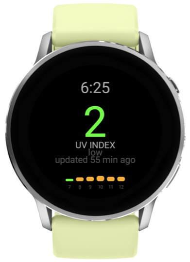

# UV Index Watch Face

A minimal, battery-efficient Garmin Connect IQ watch face designed for **Garmin Venu 4** and **Venu 4S** that displays the current UV index for your location.



## Installation

### From the Garmin Connect IQ Store (Recommended)

1. Open the **Garmin Connect IQ** app on your iOS or Android device.
2. Search for **"UV Index Watch Face"** (or visit the store page directly).
3. Tap **Install** to sync the watch face to your device wirelessly over Bluetooth.

---

## Features

- **Zero-Configuration Weather Data**: Automatically retrieves local UV index values via Garmin's built-in `Toybox.Weather` API fed from your paired smartphone. No API keys or extra companion apps required.
- **Data Staleness Indicator**: Displays `"updated N min ago"` based on `observationTime` so you know exactly how recently weather data was synced from your phone.
- **WHO UV Scale Color Coding**: Color-coded numbers based on official World Health Organization standards:
  - 🟢 **0 – 2 (Low)**: Green
  - 🟡 **3 – 5 (Moderate)**: Yellow
  - 🟠 **6 – 7 (High)**: Orange
  - 🔴 **8 – 10 (Very High)**: Red
  - 🟣 **11+ (Extreme)**: Purple (`#AA55FF`)
- **AMOLED & Burn-In Protection**:
  - Pure black background optimized for AMOLED displays.
  - Active pixel shifting in low-power / Always-On Display (AOD) mode.
  - Reduced brightness and minimal elements during sleep state to preserve screen life and battery.
- **Offline / Sync Indicator**: Displays `--` when weather data has not yet synced from the phone or is unavailable.

---

## Development & Building from Source

If you want to modify or contribute to this watch face, you can build and run it locally using the Connect IQ SDK.

### Prerequisites

- [Garmin Connect IQ SDK](https://developer.garmin.com/connect-iq/sdk/) (v3.2.0 or higher)
- Visual Studio Code with the **Monkey C** extension installed
- A valid Garmin Developer Key (`developer_key`) for compilation and signing

### Building & Running in Simulator

1. Clone this repository:
   ```bash
   git clone https://github.com/zhendawgfr/uvface.git
   cd uvface
   ```
2. Open the project folder in VS Code.
3. Press `F5` to launch the Connect IQ Simulator.
   - Test weather states via **Simulation → Weather**.
   - Test AMOLED burn-in protection shift & dimming via **Simulation → Toggle Low Power Mode**.
4. To build for a physical device:
   - Open Command Palette (`Cmd+Shift+P` / `Ctrl+Shift+P`) → **Monkey C: Build for Device** → Select `venu445mm` (Venu 4 45mm) or `venu441mm` (Venu 4 41mm).

### Manual Sideloading (USB)

1. Build the `.prg` file using **Monkey C: Build for Device**.
2. Connect your watch via USB and copy the output `.prg` file into the `/GARMIN/Apps/` folder on your watch storage.

---

## Project Structure

```
├── manifest.xml                          # Connect IQ manifest (Target: venu445mm + venu441mm, Min API 3.2.0)
├── monkey.jungle                         # Project jungle configuration
├── source/
│   ├── UvFaceApp.mc                      # Application entry point
│   └── UvFaceView.mc                     # Watch face view and rendering logic
└── resources/
    ├── strings/strings.xml               # String resources
    ├── drawables/                        # App icons and graphics
    └── screenshot3.png                   # Real device screenshot
```

## License

This project is open source and available under the [MIT License](LICENSE).
